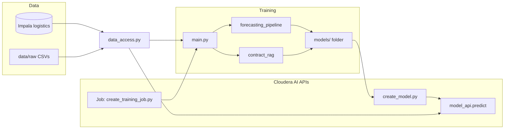

# Supply Chain Price Forecasting Demo (Cloudera AI)

Customer-ready companion to the Student Loan Risk demo pattern: **warehouse-backed procurement data**, **forecasting models that match real data challenges**, and **RAG over a mock contract** fused with structured pricing to narrate spikes.

This README is written so you can understand the project **without prior ML background**. Skip ahead using the table of contents.

### What this proves (at a glance)

| Ask | How it is shown |
|-----|-----------------|
| **Predictive modeling (ARIMA / LSTM / Gradient Boosting)** | Monthly **Turbine Oil** NSN `9150-01-123-4567`: **ARIMA**, **HistGradientBoostingRegressor** on lags + demand + market features, optional **TensorFlow LSTM**. |
| **Sparse / intermittent demand** | **Legacy Valve** NSN `4820-00-111-2222`: irregular timestamps → **HistGradientBoosting** with `gap_days`, market deltas, supplier KPIs. |
| **Unstructured + structured fusion (RAG)** | Mock PDF → chunked retrieval (**sentence-transformers** or TF-IDF fallback) → joined with warehouse-style price/order context. |

---

## Table of contents

1. [Big picture — two phases](#big-picture--two-phases-training-vs-serving)
2. [Machine learning in plain language](#machine-learning-in-plain-language)
3. [What each model type actually does](#what-each-model-type-actually-does)
4. [How the pieces connect](#how-the-pieces-connect)
5. [Data: warehouse vs CSV](#data-warehouse-vs-csv)
6. [Artifacts in `models/`](#artifacts-in-models)
7. [Quickstart (train locally or in Workbench)](#quickstart)
8. [Serving API (`model_api.predict`)](#model-serving-pipeline-behind-the-dashboard)
9. [Cloudera AI: Jobs vs Models](#cloudera-ai-jobs-training-vs-models-serving)
   - [Compared to Cloudera AMPs](#compared-to-cloudera-amps)
10. [Cloudera AI Experiments (MLflow tracking)](#cloudera-ai-experiments--mlflow-tracking)
11. [Recommended order on CML](#recommended-order-on-cloudera-ai)
12. [Troubleshooting](#troubleshooting)
13. [Notebooks & touchpoints](#notebooks)

---

## Big picture — two phases (training vs serving)

| Phase | What runs | What it produces / uses |
|--------|-----------|-------------------------|
| **Training** | `main.py` → `utils/forecasting_pipeline.py`, optional PDF + `utils/contract_rag.py` | Files under **`models/`** (saved models, indexes, metadata) |
| **Serving** | **`model_api.predict`** (after you deploy with `create_model.py`) | Loads **`models/`**, answers HTTP/JSON requests (forecasts, explanations, health) |

**Training** = learn patterns from **past** data and write files to disk.  
**Serving** = load those files and answer **new** questions using **fresh** data where needed.

You must **train first** (so `models/` exists), then **deploy** the model. They solve different problems.

---

## Machine learning in plain language

- **Supervised learning:** show the computer many examples of inputs and the correct answer; it finds rules that **predict** the answer for new inputs. Here the “answers” are things like **next month’s price** or **price after a long gap**.
- **Time series:** data ordered by time (monthly prices). Some methods assume **regular** spacing (every month); others handle **irregular** gaps.
- **Artifacts:** after training, learned rules are saved as **files** (`*.joblib`, optional `*.keras`). At serving time, Python **loads** those files — it is not re-training on every API call.
- **RAG (retrieval-augmented generation):** the contract PDF is split into chunks and indexed. At query time, the system **retrieves** relevant chunks and combines them with **structured** price/order data so explanations cite **both** numbers and contract text.

Nothing here “thinks” like a human; it **fits patterns** from history and applies them with **math**.

---

## What each model type actually does

### Dense demand (example NSN: Turbine Oil `9150-01-123-4567`)

This part is ordered **often**, so there is a **long run of monthly-ish prices**.

Three strategies are trained on the same history:

| Model | Idea (non-technical) |
|--------|----------------------|
| **ARIMA** | “Prices tend to drift and wobble in a stable way.” Mostly uses **the price line over time** to extrapolate. |
| **Gradient boosting (HistGradientBoosting)** | “Guess next month’s price from **recent prices**, **order volume**, **market index**, and **calendar month**.” Learns weighted rules from examples. |
| **LSTM** (optional, needs TensorFlow) | Looks at the **last several months** of prices as a **sequence** and predicts the next step — useful when patterns are nonlinear. |

When you ask for a **dense forecast**, the API uses these saved models plus **current** price history from `data_access`.

### Sparse / intermittent demand (example: Legacy Valve `4820-00-111-2222`)

Some parts appear **rarely**, with **years** between purchases. A “every month” model is a poor fit.

Instead, each **gap between purchases** becomes one training row: days since last price, market change, supplier shipping stats, etc. A **single gradient boosting model** learns: “in situations like this, what price showed up next?” Predictions are **event-style**, not a full calendar of months.

### Contract RAG (PDF)

Separate from the numeric forecasts: text chunks from **`contracts/CON-7781_Turbine_Oil_Supply_Agreement.pdf`** are embedded (or TF-IDF fallback). **`explain_spike`** retrieves relevant clauses and joins them with structured context from your tables.

---

## How the pieces connect



- **`utils/data_access.py`** is the **single gate** for procurement tables: try Impala first, fall back to CSV (read-only, **no warehouse writes**).
- **`main.py`** orchestrates training and optional PDF/RAG index build.
- **`model_api.py`** loads **`models/`** at startup and calls the same **`data_access`** helpers when a request needs fresh series.

---

## Data (warehouse vs CSV)

Database: **`logistics`**  

Tables (same names as CSV files without `.csv`):

- `supplier_shipping_performance`
- `item_price_history_forecasting`
- `procurement_transactions`

Training and **`model_api`** read Impala via **`cml.data_v1`** when available; **if tables are empty or reads fail**, data loads from **`data/raw/`** or **`LOGISTICS_DATA_DIR`**. Set **`LOGISTICS_DATA_SOURCE=csv`** to skip Impala. **`python load_logistics_data.py`** prints Impala row counts only (read-only).

---

## Artifacts in `models/`

After training you should see examples such as:

| File | Role |
|------|------|
| `dense_arima_fit.joblib` | Saved ARIMA model for the dense NSN |
| `dense_gbm.joblib` | Gradient boosting bundle (lags + features) |
| `dense_lstm.keras`, `dense_lstm_meta.joblib` | Optional LSTM + scaler metadata |
| `sparse_gbm.joblib` | Sparse-demand gradient boosting |
| `contract_rag_index.joblib` | RAG index (if PDF/index built) |
| `forecasting_metadata.json` | Metrics and experiment tag (`EXPERIMENT_NAME` if set) |

If Hugging Face downloads are blocked, **semantic embeddings fall back to TF-IDF** automatically.

---

## Quickstart

On **Cloudera AI**, keep the three CSVs in **`data/raw/`** (or **`LOGISTICS_DATA_DIR`**) when warehouse tables have no rows.

```bash
cd Supply-Chain-Forecasting-Demo
pip install -r requirements.txt

# Optional: force CSV-only reads (skip Impala):
export LOGISTICS_DATA_SOURCE=csv
export LOGISTICS_DATA_DIR=/path/to/folder_with_three_csvs   # or rely on data/raw/

python main.py --all          # builds PDF + trains + builds RAG index (if reportlab / deps available)
```

---

## Model serving (pipeline behind the dashboard)

Entry point: **`model_api.predict`**

Example payloads:

```json
{"action": "forecast_dense", "nsn": "9150-01-123-4567", "horizon_months": 6}
```

```json
{"action": "forecast_sparse", "nsn": "4820-00-111-2222"}
```

```json
{"action": "explain_spike", "nsn": "9150-01-123-4567", "contract_id": "CON-7781", "rag_query": "energy surcharge index lubricant"}
```

```json
{"action": "health"}
```

Deploy with **`create_model.py`** inside Cloudera AI (requires `CDSW_API_URL`, `CDSW_APIV2_KEY`, `CDSW_PROJECT_ID`). Schedule training with **`create_training_job.py`** / **`submit_experiment_jobs.py`** (same credentials).

---

## Cloudera AI: Jobs (training) vs Models (serving)

| Capability | What exists in this repo | Credentials / runtime |
|------------|--------------------------|------------------------|
| **Jobs API** — run `main.py` on a schedule or on demand | **`create_training_job.py`**; **`submit_experiment_jobs.py`** for multiple **`EXPERIMENT_NAME`** values | `CDSW_API_URL`, `CDSW_APIV2_KEY`, `CDSW_PROJECT_ID`; **`CML_RUNTIME_ID`** or **`--runtime`** on ML Runtime projects |
| **Models API** — HTTP deployment of `model_api.predict` | **`create_model.py`** | Same API vars; **`CML_RUNTIME_ID`** should match the Workbench **Python runtime** you use for Jobs (e.g. Python 3.13 image) |
| **Experiments (UI)** | **`utils/cml_experiments.py`** + MLflow in **`run_training`** | ML Runtime Jobs/Sessions; **`MLFLOW_EXPERIMENT_NAME`**, **`EXPERIMENT_NAME`** (run label); see [below](#cloudera-ai-experiments--mlflow-tracking) |

**Jobs** automate **training**. **Models** expose **`predict`** over the network. Use **the same runtime image** for Jobs and model builds when possible so dependencies and Python versions align.

Training picks **`DENSE_DEMO_NSN`** from the environment when set.

**Before Models:** run **`python main.py --all`** (or a Job that runs it) so **`models/`** contains artifacts the served model loads.

### Compared to Cloudera AMPs {#compared-to-cloudera-amps}

#### MLflow Tracking (`CML_AMP_MLFlow_Tracking`)

That prototype keeps **`requirements.txt`** tiny (sklearn + mlflow-skinny + pinned protobuf), declares **`PYTHONPATH=/home/cdsw`** in **`.project-metadata.yaml`**, and ships an **Install Dependencies** job — so images stay small and imports work from any cwd. It does **not** use the **CML Models API** (no HTTP `predict` deployment); this demo does.

This repo adopts the same **AMP mechanics** where they help deployment:

| AMP pattern | In this project |
|-------------|-----------------|
| **`.project-metadata.yaml`** `environment_variables` | **`PYTHONPATH`** + default **`CDSW_REQUIREMENTS_PROFILE=model`** so model **builds** pick up slim deps without relying on user-only env vars |
| **`cml/install_dependencies.py`** job | Same idea: run **`pip install -r requirements.txt`** for the **full** training/notebook stack |
| Minimal deps | We cannot shrink `requirements.txt` as far as the AMP without dropping LSTM/RAG; instead **`requirements-model.txt`** + **`cdsw-build.sh`** profiles keep **model images** small |

#### Continuous Model Monitoring (`CML_AMP_Continuous_Model_Monitoring`)

That AMP deploys a **hosted model** with **[Model Metrics](https://docs.cloudera.com/machine-learning/cloud/model-metrics/topics/ml-enabling-model-metrics.html)** enabled: **`scripts/predict.py`** uses **`@models.cml_model(metrics=True)`** and **`metrics.track_metric(...)`**, declares **`feature_dependencies: [model_metrics]`**, and lists **`create_model`** → **`build_model`** → **`deploy_model`** in **`.project-metadata.yaml`**. Its **`cdsw-build.sh`** is only **`pip3 install -r requirements.txt`** because dependencies are light.

**Already aligned in this repo:** **`model_api.predict`** uses the same decorator and tracks metrics (for example **`action`**). **Now aligned in metadata:** **`feature_dependencies: [model_metrics]`** plus declarative **create / build / deploy** tasks with sample **`health`** and **`forecast_dense`** payloads — so an AMP-style launch can provision the model without **`create_model.py`**. You can still deploy manually with **`python create_model.py`**; avoid running **both** flows unless you want two models.

If project creation fails because **`model_metrics`** is not enabled on your workspace, remove the **`feature_dependencies`** block from **`.project-metadata.yaml`** or ask your admin to enable Model Metrics.

---

## Cloudera AI Experiments & MLflow tracking {#cloudera-ai-experiments--mlflow-tracking}

Cloudera AI **Experiments** (v2) use the **[MLflow Tracking API](https://docs.cloudera.com/machine-learning/1.5.5/experiments/topics/ml-exp-v2-tracking.html)** so runs appear under **Project → Experiments** (see also the [PDF overview](https://docs.cloudera.com/machine-learning/1.5.5/experiments/ml-experiments.pdf)).

After each successful **`run_training`** (via **`main.py --train`** / **`--all`** or a Job), **`utils/cml_experiments.py`** logs:

- **Parameters:** dense NSN, optional experiment label, sparse strategy, point count  
- **Metrics:** holdout MAEs for ARIMA, dense GBM, sparse GBM, and LSTM when trained  
- **Artifact:** **`models/forecasting_metadata.json`** under the run  

**Environment variables**

| Variable | Role |
|----------|------|
| **`MLFLOW_EXPERIMENT_NAME`** | Experiment name in the UI (created if missing). Default: **`Supply Chain Forecasting`** |
| **`EXPERIMENT_NAME`** | Also written into **`forecasting_metadata.json`**; used as the **MLflow run name** when set |
| **`MLFLOW_RUN_NAME`** | Run name if you prefer not to reuse **`EXPERIMENT_NAME`** |
| **`MLFLOW_DISABLE`** | Set to **`1`** / **`true`** to skip MLflow logging (local smoke tests) |

Use an **ML Runtime** session or job (Experiments do not run on the legacy engine). **`mlflow`** is listed in **`requirements.txt`**; CML often preinstalls MLflow in runtimes, but listing it keeps Jobs reproducible.

---

## Recommended order on Cloudera AI

1. **Install dependencies:** either run **`pip install -r requirements.txt`** in a Workbench terminal, or run the **Install Dependencies** job created from **`.project-metadata.yaml`** (same outcome as the MLflow AMP — see **`cml/install_dependencies.py`**). **`cdsw-build.sh`** still runs during **model image build**; project env should include **`CDSW_REQUIREMENTS_PROFILE=model`** via metadata or Project settings (see [Troubleshooting](#troubleshooting)).
2. **Train:** run **`main.py`** interactively or **`create_training_job.py --run`** (Jobs force **`CDSW_REQUIREMENTS_PROFILE=full`** so training uses the full requirements file). Open **Experiments** in the project to compare MLflow runs and metrics.
3. **Verify** `models/` contains the expected files.
4. **Deploy:** either run **`python create_model.py`** (Models API from Workbench), **or** rely on the **create_model → build_model → deploy_model** steps in **`.project-metadata.yaml`** when using **Launch as Project / AMP** (same pattern as **Continuous Model Monitoring** — do not duplicate both unless you intend to). Set **`CML_RUNTIME_ID`** if your site’s ML Runtime differs from the default.
5. **Test** the deployment URL with **`{"action":"health"}`** then a forecast payload.

---

## Troubleshooting

### `ModuleNotFoundError: No module named 'joblib'` (model fails to start)

The model runtime executes **`model_api.py`** in an ML Runtime kernel. That environment includes **base Python** but **not** every package from **`requirements.txt`** until they are installed for the **project**.

**Fix:**

1. In **Workbench**, open a terminal in **this project** and run:
   ```bash
   pip install -r requirements.txt
   ```
   Install at least **`joblib`**, **`pandas`**, **`numpy`**, **`scikit-learn`**, **`statsmodels`**, and any stack your site needs for RAG/LSTM (`pypdf`, optional `tensorflow`, `sentence-transformers`, etc.).

2. If your site uses **project-level dependency settings** (e.g. pinned packages in the UI), add the same dependencies there so **model replicas** see them.

3. **Redeploy** the model (new build) after dependencies are installed.

4. Use the **same `CML_RUNTIME_ID`** for Jobs and **`create_model.py`** so Python versions match.

Logs often show **`Finish start model: failed`** with an **`ename`** such as **`ModuleNotFoundError`**. Messages like **`use of closed network connection`** usually happen **after** the kernel exits because the import failed — fix the **first** Python error, not the websocket line.

### Job / notebook quirks (`__file__`, `ipykernel`, `reportlab`)

If **`main.py`** runs inside Jupyter-style execution, path and argparse quirks were handled in code (project root resolution, `parse_known_args`, optional PDF when **`reportlab`** is missing). Prefer **`python main.py`** from a terminal when possible.

### Runtime ID errors (`runtime ID must be specified`)

On **ML Runtime projects**, Jobs and model builds need **`runtime_identifier`**. Set **`CML_RUNTIME_ID`** to your environment’s image, or rely on the default in **`create_training_job.py`** / **`create_model.py`**.

### Model build: `failed to push ... s2i-registry ... blob upload invalid` / `unknown: unknown error`

The image **build** finished (`exporting layers` succeeded), but **pushing** to the cluster registry failed. That often happens when the image is **too large**: on Linux, **`sentence-transformers`** pulls **`torch`** from PyPI, which defaults to **CUDA builds** and drags in **multi‑gigabyte NVIDIA wheel layers**, on top of TensorFlow and (if present) Jupyter.

**Fix (recommended):**

1. Set **`CDSW_REQUIREMENTS_PROFILE=model`** in **Project** settings → **Environment variables** (or site admin global env). **Personal / user-level environment variables are not passed into model image builds** on many Cloudera AI deployments, which is why the build log still shows **`requirements.txt`** if you only set it on your user profile. **`create_model.py`** also tries to pass this on the build request when your **`cmlapi`** supports it.
2. Redeploy so **`cdsw-build.sh`** uses **`requirements-model.txt`** (slim) and installs **CPU-only PyTorch** before the rest. Successful slim builds log **`profile=model`** and **`requirements-model.txt`** (not only **`requirements.txt`**).
3. Keep **`requirements.txt`** for Workbench sessions and **training Jobs** (full stack including Jupyter / Streamlit if you use them). **`create_training_job.py`** sets **`CDSW_REQUIREMENTS_PROFILE=full`** on the Job so training still installs the full file even when the project default is **`model`**.

If it still fails after slimming the image, treat it as a **platform/infrastructure** issue (registry disk/quota, ingress body limits, known Harbor/registry bugs). Open a ticket with your platform team and attach the build log.

---

## Notebooks

Open `notebooks/supply_chain_forecasting_walkthrough.ipynb` for plots and RAG fusion — suitable for **CDV dashboards** or Apps calling the deployed model.

## Cloudera AI touchpoints (short)

- **Workbench / Jobs:** `create_training_job.py`, `submit_experiment_jobs.py`, or `main.py` manually.  
- **Model Registry / Serving:** `create_model.py` + `model_api.py` (`predict`).  
- **Warehouse:** `utils/data_access.py` (read-only); `load_logistics_data.py` for row counts.  
- **Experiments:** `EXPERIMENT_NAME` / `MLFLOW_EXPERIMENT_NAME` → MLflow UI + `forecasting_metadata.json`.

Synthetic mock data only; safe for public demos.
